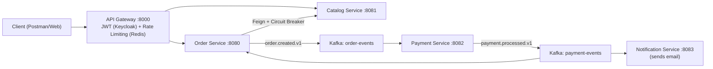

# 🚀 OrderHub — Distributed Order Platform

🇧🇷 [Português](README.md) | 🇬🇧 English

[](https://github.com/Adriano-silva131/order-hub/actions/workflows/ci.yml)


[](LICENSE)

An e-commerce platform built with a microservices architecture, event-driven communication via Kafka, and a full observability stack. Built as a proof of concept for scalable, resilient, highly-available architectures.

---

## 🏗️ System Architecture

The system follows the **API Gateway** pattern combined with **Authentication Offloading**: security enforcement and rate limiting live at the edge, while internal services run on an isolated network focused purely on business logic.



---

## ⚙️ Services

| Service                | Port | Main Responsibility                                                    |
|-------------------------|------|-------------------------------------------------------------------------|
| `api-gateway`           | 8000 | Single entry point, routing, JWT validation and rate limiting (Redis). |
| `order-service`         | 8080 | Order creation, persistence (PostgreSQL) and initial orchestration.    |
| `catalog-service`       | 8081 | Product catalog with a flexible schema (MongoDB).                      |
| `payment-service`       | 8082 | Asynchronous payment processing and idempotency check (PostgreSQL).    |
| `notification-service`  | 8083 | Dual topic consumption for transactional emails via Gmail SMTP.        |

---

## 🛠️ Tech Stack

### Development & Frameworks

| Technology          | Purpose                                                                |
|----------------------|-------------------------------------------------------------------------|
| Java 21              | Main language, leveraging Virtual Threads and Records.                 |
| Spring Boot 4.0.3    | Base framework for productivity.                                       |
| Spring Cloud         | Native routing (Gateway), Feign Clients and Circuit Breaker.           |
| Spring WebFlux       | Reactive, non-blocking programming at the edge (Gateway).              |
| Spring Kafka         | Producers and consumers for the event mesh.                            |
| Resilience4j         | Protection against cascading failures (Circuit Breaker).               |
| Flyway               | Safe database version control (migrations).                            |

### Infrastructure & DevOps

| Tool                   | Purpose                                                                |
|--------------------------|---------------------------------------------------------------------|
| Docker Compose            | Local orchestration with network isolation.                        |
| PostgreSQL & MongoDB      | Polyglot persistence tailored to each domain's needs.               |
| Apache Kafka (KRaft)      | Backbone for asynchronous, event-driven communication.              |
| Redis                     | In-memory store for traffic control (Token Bucket).                 |
| Keycloak                  | Identity Provider for access management via OAuth2/OIDC.            |
| Prometheus & Grafana      | Metrics collection (Actuator/Micrometer) and real-time dashboards.  |
| GitHub Actions            | CI pipeline with a parallel matrix build.                           |

---

## 🧠 Architectural Decisions (ADRs)

1. **Authentication Offloading + Network Isolation:** The JWT is validated exclusively at the Gateway. Internal microservices have no Spring Security dependency, reducing boilerplate. Direct access is blocked since no internal service ports are exposed in Docker Compose.

2. **Asynchronous Communication (Choreographed Saga):** Strong temporal decoupling. If `notification-service` goes down, order creation and payment processing keep working — emails are processed as soon as the service comes back.

3. **Polyglot Persistence:** PostgreSQL guarantees ACID transactions for payments and orders. MongoDB offers a flexible schema for the catalog's variable product attributes.

4. **Circuit Breaker on Order Service:** If `catalog-service` becomes unstable, the circuit opens quickly, protecting the system from thread exhaustion and cascading failures.

5. **Per-User Rate Limiting:** Token Bucket algorithm on Redis, keyed by the `sub` (Subject ID) claim extracted from the JWT, preventing a single user from overwhelming the infrastructure.

6. **Docker Multi-Stage Build:** Separates the build stage (JDK + Gradle) from the runtime stage (JRE Alpine), producing secure images with no exposed source code and a considerably smaller footprint.

7. **Dead Letter Topic with Reprocessing:** DLT implementation for messages that fail after retries with exponential backoff, guaranteeing eventual delivery without manual intervention.

---

## 🚀 Getting Started (Plug & Play)

The infrastructure is designed to come up with a single command, wiring up databases, messaging, observability and all microservices.

**1. Clone the repository:**

```bash
git clone https://github.com/Adriano-silva131/order-hub.git
cd order-hub/infra
cp .env.example .env   # fill in the values before starting the stack
```

**2. Start the full infrastructure:**

```bash
docker compose up -d --build
```

**3. Check the core services:**

| Service                      | URL                                              |
|-------------------------------|--------------------------------------------------|
| API Gateway                   | http://localhost:8000                            |
| Keycloak (token issuing)      | http://localhost:9090                            |
| Grafana (dashboards)          | http://localhost:3000 *(the "JVM (Micrometer)" dashboard is already provisioned; default login `admin`/`admin`)* |
| Swagger UI — orders           | http://localhost:8000/docs/orders/swagger-ui/index.html |
| Swagger UI — products         | http://localhost:8000/docs/products/swagger-ui/index.html |

Interactive API docs are served through the api-gateway itself (no internal service ports exposed). "Try it out" calls the real, authenticated API at `http://localhost:8000/api/v1/...` — a valid Keycloak JWT is still required to execute requests.

(Note on emails: the system sends real emails to the address configured via the notification-service environment variables/properties, through Gmail SMTP).

---

## 🤝 Contributing

Suggestions, issues and PRs are welcome — see [CONTRIBUTING.md](CONTRIBUTING.md). This project is distributed under the [MIT license](LICENSE).

---
