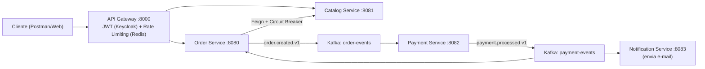

# 🚀 OrderHub — Plataforma de Pedidos Distribuída

🇧🇷 Português | 🇬🇧 [English](README.en.md)

[](https://github.com/Adriano-silva131/order-hub/actions/workflows/ci.yml)


[](LICENSE)

Plataforma de e-commerce construída com arquitetura de microsserviços, comunicação orientada a eventos via Kafka e stack completa de observabilidade. Desenvolvida como prova de conceito para arquiteturas escaláveis, resilientes e de alta disponibilidade.

---

## 🏗️ Arquitetura do Sistema

O ecossistema adota o padrão **API Gateway** acoplado com **Authentication Offloading**, garantindo que a regra de segurança e rate limiting fique na borda, enquanto os serviços internos operam em uma rede isolada focados puramente no domínio de negócio.



---

## ⚙️ Serviços Implementados

| Serviço               | Porta | Responsabilidade Principal                                              |
|-----------------------|-------|-------------------------------------------------------------------------|
| `api-gateway`         | 8000  | Ponto único de entrada, roteamento, validação JWT e Rate Limiting (Redis). |
| `order-service`       | 8080  | Criação de pedidos, persistência (PostgreSQL) e orquestração inicial.   |
| `catalog-service`     | 8081  | Catálogo de produtos com schema flexível (MongoDB).                     |
| `payment-service`     | 8082  | Processamento assíncrono e verificação de idempotência (PostgreSQL).    |
| `notification-service`| 8083  | Consumo duplo de tópicos para envio de e-mails transacionais utilizando o SMTP do Gmail.    |

---

## 🛠️ Stack Tecnológica

### Desenvolvimento & Frameworks

| Tecnologia        | Propósito                                                              |
|-------------------|------------------------------------------------------------------------|
| Java 21           | Linguagem principal aproveitando Virtual Threads e Records.            |
| Spring Boot 4.0.3 | Framework base para produtividade.                                     |
| Spring Cloud      | Roteamento nativo (Gateway), Feign Clients e Circuit Breaker.          |
| Spring WebFlux    | Programação reativa e não-bloqueante na borda (Gateway).               |
| Spring Kafka      | Produtores e consumidores para a malha de eventos.                     |
| Resilience4j      | Proteção contra falhas em cascata (Circuit Breaker).                   |
| Flyway            | Versionamento seguro de banco de dados (Migrations).                   |

### Infraestrutura & DevOps

| Ferramenta            | Propósito                                                              |
|-----------------------|------------------------------------------------------------------------|
| Docker Compose        | Orquestração local garantindo isolamento de rede.                      |
| PostgreSQL & MongoDB  | Persistência poliglota adaptada à necessidade do domínio.              |
| Apache Kafka (KRaft)  | Backbone de comunicação assíncrona (Event-Driven).                     |
| Redis                 | Memória ultrarrápida para controle de tráfego (Token Bucket).          |
| Keycloak              | Identity Provider para gestão de acessos via OAuth2/OIDC.              |
| Prometheus & Grafana  | Coleta de métricas (Actuator/Micrometer) e dashboards em tempo real.   |
| GitHub Actions        | Pipeline CI com Matrix Build executando em paralelo.                   |

---

## 🧠 Decisões Arquiteturais (ADRs)

1. **Authentication Offloading + Network Isolation:** O JWT é validado exclusivamente no Gateway. Microsserviços não possuem dependências de Spring Security, reduzindo boilerplate. O acesso direto é bloqueado pela ausência de portas expostas no Docker Compose.

2. **Comunicação Assíncrona (Saga Coreografada):** Forte desacoplamento temporal. Se o `notification-service` cair, o pedido e o pagamento continuam funcionando. Os e-mails serão processados assim que o serviço retornar.

3. **Persistência Poliglota:** PostgreSQL garante transações ACID para pagamentos e pedidos. MongoDB oferece esquema flexível para atributos variáveis de produtos do catálogo.

4. **Circuit Breaker no Order Service:** Se o `catalog-service` ficar instável, o circuito se abre rapidamente, protegendo o sistema de exaustão de threads e falhas em cascata.

5. **Rate Limiting por Usuário:** Utilização do algoritmo Token Bucket no Redis, mapeando as restrições pelo `sub` (Subject ID) extraído do JWT, evitando que um usuário derrube a infraestrutura.

6. **Docker Multi-Stage Build:** Separação entre build (JDK + Gradle) e runtime (JRE Alpine), resultando em imagens seguras, sem código-fonte exposto e consideravelmente mais leves.

7. **Dead Letter Topic com Reprocessamento:** Implementação de DLT para mensagens com falha após tentativas com backoff exponencial, garantindo a entrega eventual sem intervenção manual.

---

## 🚀 Como Executar (Plug & Play)

A infraestrutura foi desenhada para subir com um único comando, configurando bancos de dados, mensageria, observabilidade e os microsserviços integrados.

**1. Clone o repositório:**

```bash
git clone https://github.com/Adriano-silva131/order-hub.git
cd order-hub/infra
cp .env.example .env   # preencha os valores antes de subir a stack
```

**2. Suba a infraestrutura completa:**

```bash
docker compose up -d --build
```

**3. Valide os serviços essenciais:**

| Serviço                      | URL                                              |
|------------------------------|--------------------------------------------------|
| API Gateway                  | http://localhost:8000                            |
| Keycloak (Geração de Token)  | http://localhost:9090                            |
| Grafana (Dashboards)         | http://localhost:3000 *(dashboard "JVM (Micrometer)" já vem provisionado; login padrão `admin`/`admin`)* |
| Swagger UI — orders          | http://localhost:8000/docs/orders/swagger-ui/index.html |
| Swagger UI — products        | http://localhost:8000/docs/products/swagger-ui/index.html |

A documentação interativa é servida através do próprio api-gateway (sem expor as portas internas dos serviços). O botão "Try it out" chama a API real e autenticada em `http://localhost:8000/api/v1/...` — ainda é necessário um JWT válido do Keycloak para executar as chamadas.

(Nota sobre e-mails: O sistema efetua o disparo real para o e-mail configurado na variável de ambiente/properties do notification-service através do SMTP do Gmail).

---

## 🤝 Contribuindo

Sugestões, issues e PRs são bem-vindos — veja [CONTRIBUTING.md](CONTRIBUTING.md). Este projeto é distribuído sob a [licença MIT](LICENSE).

---
